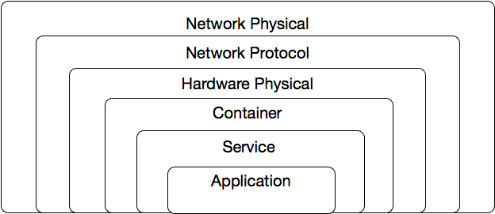

PADME Policy Definition

V2.0

Kamil Pawlowski

# Introduction

This document is an iteration on the definition of PADME policies. It contextualizes policies with respect to PADME architecture.  It illustrates policy action by considering a number of use cases.

# The Enforcement Surface Onion

To reiterate from the [PADME overview](https://docs.google.com/document/d/1NfQ08kEBCZqu_HKAZ4gcZ0ihXxH_DsejOsSmatdJC-c/edit?usp=sharing) the goals of PADME are:

* Provable, Composable Security

* Simplicity (Ease of Use)

* Defined/well understood behavior in a distributed environment (i.e. understanding the CAP theorem)  

All of these must be supported or enabled by the policy definition.

Heterogeneity is a well known problem in the infrastructure space. Everything is different and is configured differently.  It is impossible to completely reconcile all the possible configurations and configuration languages at play in the field.  Simplicity, composability and provability of security are impossible in this context.

In order to mitigate these issues, PADME defines an abstract system architecture so that a common language can be used to define policies. Such a common language can then be computed over to prove the security of a system.  The obvious caveat here is that the abstract system architecture must be accurately translated into whatever the underlying software or hardware understands.  This also means that the underlying system may be capable of more fine grain control that PADME offers, however this is a price that we are willing to pay for the benefits of a common understanding of infrastructure.

The following are at present the layers of the ESO (Enforcement Surface Onion) each layer represents a point at which an enforcement action may be taken.

Note that the number and names of the layers that exist in the final PADME definition is not important, however the concept of a layer as a point of policy enforcement is.

PADME Policies are written in terms of the ESO. An enforcer understands which layers of the ESO it can enforce policies for and applies only those policies.  Further, each layer can be specialized, for example an enforcer may support Network Protocol (TCP), and Network Protocol (HTTP), or it may support Service (WWW) for web service endpoints. It can also support policies that aggregate all three. Within PADME these specializations are called types.

A number of examples might be illustrative.  An enforcer applying policies to a firewall may support any number of Network Protocols.  Meanwhile one applying policies on a Linux machine in a datacenter might support Network Protocols (to configure IP Chains for open ports), Services for specific web endpoints, and Application for specifics of a Mysql configuration. Further, an enforcer configuring a could potentially provide a multi-layer policy covering HTTP and WWW, such a policy might have it only allow using the GET method, to the /foo endpoint.

The intent here is not to fully specify every possible protocol and system ever developed, but to provide infrastructure of the common ones, and extensibility to support esoteric ones.

## Digression on Proving Security

PADME asserts that it provides provable security.  This is done by expressing a request in terms of the language used to specify services in terms of the ESO. (This language is under evaluation).  The request can then be run against all policies to see if any disallows it.  This can be done statically. The request can be specified in terms of one or more layers and multiple components of the same layer (i.e. TCP, HTTP (both network protocol), and web endpoint (service)).  It comes down to how much detail is placed in the request. 

## The ESO and Enforcer Plugins

Enforcers may be implemented to understand how to translate PADME’s description language into decisions themselves, or they may use plugins to make these decisions.  In the latter case, a plugin advertises the ESO layer it is responsible for, and its specific nature (e.g. IP Tables or OPA).  Thus OPA can say it handles container layer and service layer operations (for example), while IP Tables says it handles network protocol operations.

## Breakdown of the ESO

### Network Physical

These are decisions taken at the physical network layer, examples of this might be rate limiting, or other traffic shaping decisions.  Different settings here might also support different media and so on.

### Network Protocol

Network protocols cover the gamut of existing protocols found in the wild.  They are intended to support use cases such as allowed port ranges, black/whitelisted IPs, domains, etc. They can also support specific HTTP commands that are allowed/disallowed, etc. Firewalling, routing and other such configurations are expected to live here.  Note that IP, TCP, UDP, as well as IP/TCP and IP/UDP can be valid here (but its going to be messy).

### Hardware Physical

This layer of the ESO should be used to configure systems without containerization, as well as raw hardware underlying containerized systems. 

### Container

The container layer is intended to configure both the environment of containers (where they can be run, and with what parameters) as well as any internals of a given container.

### Service

The service layer is specifically for applications that run multiple endpoints, with the intent to provide specific support for the common web services case. However, any application level routing can be done here.

### Application

The application layer is for any access controls applications support that are more detailed than those defined already.

## Example of a Web Service Request

A web service request being served by a LAMP stack (NOTE:  https://en.wikipedia.org/wiki/LAMP_(software_bundle)), might cross:

1. The network protocol ESO layer triggering enforcement of Network Protocol Policies covering IP, TCP, and HTTP

2. The Hardware Physical ESO Layer triggering enforcement of CPU or Memory limits

3. The Service ESO Layer verifying access to a specific web endpoint

# PADME Policy Definition and Discussion

A PADME access policy defines who/what can access a target resource, and for how long.

Thus first a resource is defined, then a duration, and finally a policy itself.  

### Naming Resources

Naming resources is tricky.  Arbitrary precision must be allowed, and such precisions must be allowed to cross layering boundaries. To this end PADME names resources using a set of rules. An individual rule identifies a layer, a type, and a pattern to match. The pattern is defined in a layer/type dependent format. The name is created by combining individual rules into a rule set, using AND and OR operations.  Wildcards are permitted in a rule if they make sense at that layer (NOTE:  For networking applications wireshark’s filter matching language may provide a solid base.).

Rule: Layer:Type:Pattern

Ruleset: Rule|(Ruleset AND Ruleset)|(Ruleset OR Ruleset)

In general rulesets obey standard left to right operator precedence. Brackets should be used to clarify precedence. However care must be taken when mixing layers, as lower layers may jump the queue, in some applications (NOTE:  It is not clear to me yet if policies should only be enforced by elements that support all the layers in that policy.  This can be quite powerful, but can also be quite dangerous as it can result in unexpected behavior.).

As examples the following comprise possibly valid names:

* network:IP: destination ip=10.0.0.2

* network:IP: destination ip=10.0.0.2 AND network TCP:destination port=443

* service:www:path=/foo OR service:www:path=/bar

* network TCP:destination port=8080 AND  (service:www:path=/foo OR service:www:path=/bar)

* container:run_location=GB

* hardware:location:physical=DE AND hardware:vendor:name=DISCO (NOTE:  We endorse no vendors)

* hardware:cpu:count=2 and container:run_location=GB

### Resource:= name, identified_by

<table>
  <tr>
    <td>name</td>
    <td>This names a specific resource to which access is being granted or denied. Names are specified in terms of Rulesets (see above). 
A dictionary of available layer and subcomponents will be derived during implementation.  Each of these pairings has its own specific address format that identifies the resource.  For example for network_protocol:IP
destination_ip=10.0.0.1 or 
destination_ip=10.0.0.1, tos=1
For service:www
path=/home </td>
  </tr>
  <tr>
    <td>identified_by</td>
    <td>This indicates what credential or identifier is used to identify the caller.  This can be a token, certificate, protocol element, etc. In the case of protocols such as SSL, kerberos, OAuth, etc. PADME presently supports only connection level identity.  Additional infrastructure is required for multiplexing protocols such as Thrift MUX or HTTP2.0 if per request auth is required.

The identified by field is formatted specifically to match a given name. Thus a few examples
network_protocol:IP  source_ip=10.0.0.0/24 
network_protocol:SSL certificate=[some cert]
Service:www: OAUTH=[OAUTH Details] </td>
  </tr>
</table>

### Duration:= start, end

<table>
  <tr>
    <td>start</td>
    <td>UTC Time</td>
  </tr>
  <tr>
    <td>end</td>
    <td>UTC Time</td>
  </tr>
</table>

### Policy:=format_version, UUID, policy_version, description, target,  allowed, disallowed, timeline, sub-policies, content, signature

<table>
  <tr>
    <td>format_version</td>
    <td>This is the version of the policy format itself</td>
  </tr>
  <tr>
    <td>UUID</td>
    <td>string - A globally unique id for this policy. ‘Globally’ here means within the same zone.  Copying policies between zones results in different uuids. </td>
  </tr>
  <tr>
    <td>policy_version</td>
    <td>number - should a policy be updated, the enforcer (and system in general should alway use the highest policy_version it knows about) </td>
  </tr>
  <tr>
    <td>description</td>
    <td>string - a human readable string for admin purposes</td>
  </tr>
  <tr>
    <td>target</td>
    <td>Resource - This is a resource object identify the entity to which access is being controlled.</td>
  </tr>
  <tr>
    <td>allowed</td>
    <td>List<Resource> - a list of resources that have been explicitly granted access to the target. This may be empty. If allowed and disallowed are not empty, disallowed wins if a resource appears in both lists.

The rules that name resources in this list should use the same layers and types as those used in the target, as this makes it more likely that the relevant enforcer will be able to match them.</td>
  </tr>
  <tr>
    <td>disallowed</td>
    <td>List<Resource> a list of resources that have been explicitly denied access to the target.  This may be empty. If allowed and disallowed are not empty, disallowed wins if a resources appears in both lists.
The types of disallowed resources must match those of the target.

The rules that name resources in this list should use the same layers and types as those used in the target, as this makes it more likely that the relevant enforcer will be able to match them.</td>
  </tr>
  <tr>
    <td>timeline</td>
    <td>Duration -  describes when the policy being being enforced and when it stops being enforced.</td>
  </tr>
  <tr>
    <td>rate</td>
    <td>Integer - the maximum number of requests per second this policy allows to be accepted. Rates must be measured outside of the PADME system and fed back in.</td>
  </tr>
  <tr>
    <td>location</td>
    <td>The location describes which parts of a zone the policy should be applied to.  This limits the distribution scope of policies.  The location maybe expressed in terms of clusters, IPs, physical locations etc.  Note that this can also be expressed in terms of a specific layer/type in the target.</td>
  </tr>
  <tr>
    <td>contents</td>
    <td>List<Plugin ID, Blob> The contents field is a mechanism by which instructions for specific enforcer plugins can be passed along with the policy. (PADME allows implementations where the enforcer or its plugins can translate or execute ESO instructions themselves or where this information is passed with the policy).  The payload Blob itself is opaque to PADME.  Given that the rules for the target, allowed and disallowed may span layers, the specific plugin is identified, and then the implementation must take over.  Multiple different plugins can be supported by one policy to simplify configuration.  For example, a single policy with rules for service:www might contain configurations for: apache, nginx and IIS. </td>
  </tr>
  <tr>
    <td>signature</td>
    <td>String - each policy is signed. This is the signature of the policy. It covers all fields except itself.  If sub policies are present they are covered by this signature. This must be verified before the policy goes into effect.</td>
  </tr>
</table>

## Composability of PADME Policies

PADME would like policies to be like LEGO bricks.  It must be possible to add them to create larger more complex policies, as well as take them apart.  This end PADME allows policies to be composed into bundles of arbitrary depth.  At the highest level is a single zone bundle which serves as the container for all the policies in a given zone. 

### Policy Bundle:= list<Policy|Policy Bundle|Policy Line>

<table>
  <tr>
    <td>format_version</td>
    <td>This is the version of the policy bundle format itself</td>
  </tr>
  <tr>
    <td>UUID</td>
    <td>string - A globally unique id for this policy bundle. ‘Globally’ here means within the same zone.  Copying policy bundles between zones results in different uuids. </td>
  </tr>
  <tr>
    <td>policy_version</td>
    <td>number - should a policy bundle  be updated, the enforcer (and system in general should alway use the highest policy_version it knows about) </td>
  </tr>
  <tr>
    <td>description</td>
    <td>string - a human readable string for admin purposes</td>
  </tr>
  <tr>
    <td>policies</td>
    <td>list<policy|policy bundle|policy line>  These contain aggregated policies.  The list may contain any number and any mix of policies, bundles or lines. The evaluation and order of operations on these (especially policy lines are explained below).</td>
  </tr>
</table>

At this point, things get tricky. With composability of policies there is a need for a consistent, intelligible way to determine the behavior of the system. One must be able to tell if a request will be accepted or not.  The rules below describe how policies interact with one another.  Further there is one final rule that is the catch all: any operation not explicitly allowed by policy is disallowed. 

### Policy Lines

A policy line, is identical to a rule set, save that it operates on a policy level not a rule level. AND and OR operations are supported.  Evaluation order is identical to rulesets.  An AND operation is evaluated by performing the AND of the two rule sets, and taking the intersection of the allowed lists, and the union of the disallowed lists.  An OR operation is an OR of the rule sets, a union of the allowed lists, and an intersection of the disallowed lists.  Care must be taken to ensure that the resulting contents fields are meaningful (NOTE:  It is not clear at present what the correct semantics for content fields are, however it is clear that for this each policy should be carefully constructed for composability.). 

### Evaluation of Policies, Bundles and Lines

Within a policy bundle policies are applied sequentially in declaration order.  Evaluation stops, with the request being rejected once any policy accepts or rejects the request (NOTE:  Another options is to reject at first strike, and accept provisionally until a policy that disallows is found (and obviously not the default policy).).   Thus policies are applied one by one, if a bundle is encountered testing of the request recurses into the bundle (depth first) continuing until either a policy match is found or the bundle has been exhausted.  Lines are processed in the same way.

