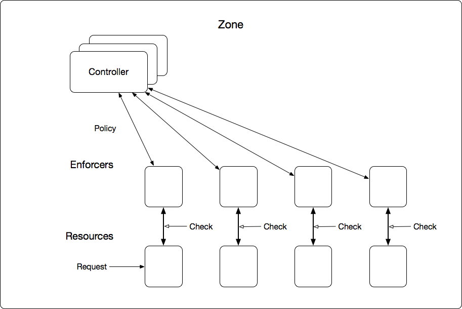
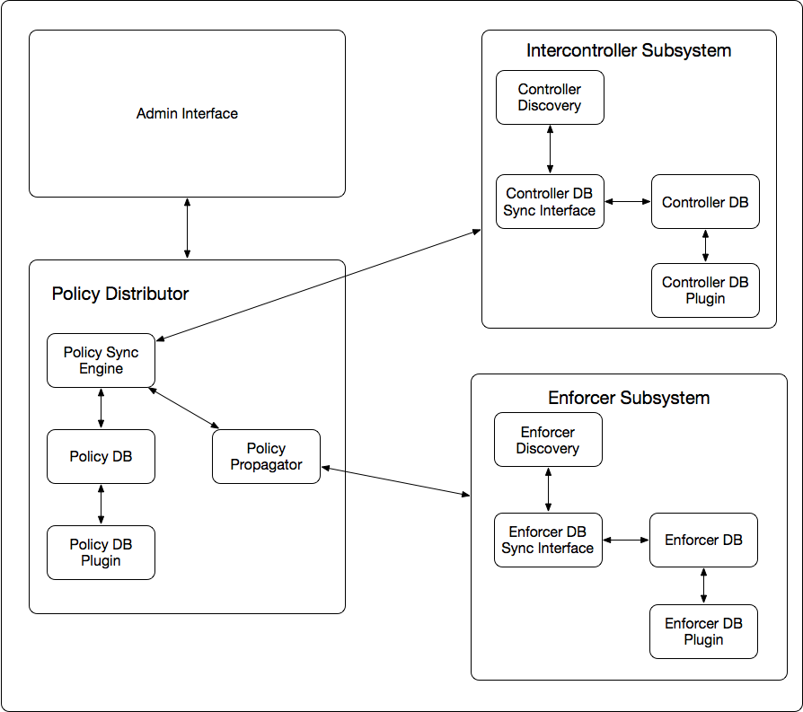
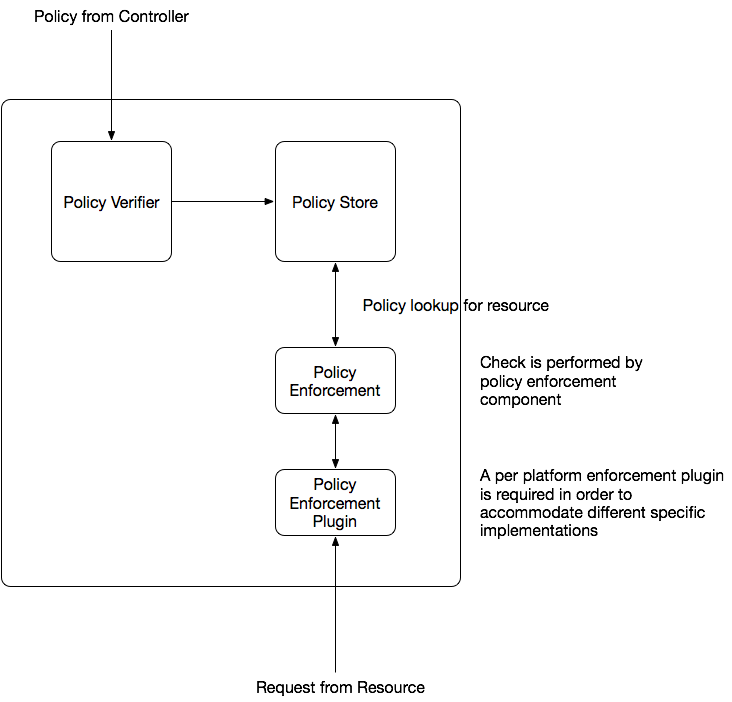

PADME Reference Architecture

Author: Kamil Pawlowski

# Introduction

This document provides a high level reference architecture that can be used to guide the implementation of PADME. It is based upon [Padme Use Cases](https://docs.google.com/document/d/16DS-FACWAG4eFrV2udWf6QEOpxDa4BlBkQzlzrr_mA0/edit?usp=sharing) and [Padme Overview](https://docs.google.com/document/d/1NfQ08kEBCZqu_HKAZ4gcZ0ihXxH_DsejOsSmatdJC-c/edit?usp=sharing). It aims to provide a skeleton for the implementation of [Padme ](https://docs.google.com/document/d/1Rh9uOf4T9-LztBf8Ha7GQdi-xY6bZ3-b95jHxC6SpHo/edit?usp=sharing)[MVP](https://docs.google.com/document/d/1Rh9uOf4T9-LztBf8Ha7GQdi-xY6bZ3-b95jHxC6SpHo/edit?usp=sharing).

# Overall Padme Architecture

A Padme System consists of independent, self contained Zones.  A Zone is controlled by a number of controllers. These controllers share control of the zone, providing resilience against network partitions and failures.  Policy enforcement is done by Enforcers which execute checks on behalf of resources.  Control of all Enforcers in a Zone is shared between all of that zone’s controllers.  Administrators communicate with one or more controllers in order to manipulate policies which are distributed to the enforcer.  Enforcers then apply and enforce those policies.

## Compliant Implementations

The component architectures presented below provide a reference abstraction. They define interactions between components and allow limit of acceptable behavior/performance to be established.  They do not govern implementation detail.  A Padme compliant implementation may externalize some or all of the components described.  Such an implementation must conform to published interfaces and behaviors.  It must interoperate. 

For example, a controller might be built on top of a distributed store. Such an implementation might externalize some or all of the components of the controller to the store. Interoperation in such a case means that an arbitrary client which complies with the Padme Admin Interface must be able to connect to administer it [the implementation].  Similarly other implementations must be able to interoperate at the inter-controller and controller/enforcer boundaries. 

# Controller Architecture

A Controller is made up of four primary components: an Admin Interface, a Policy Distributor, a Intercontroller Subsystem, and an Enforcer Subsystem.  The Admin Interface is how policies are manipulated by administrators.  The Intercontroller Subsystem is used to talk to other controllers in the zone.  The Enforcer Subsystem similarly is used to talk to all the Enforcers in the zone. The policy distributor maintains the database of policies in the zone. It uses, the Intercontroller Subsystem to share policies with other controllers, and the Enforcer Subsystem to distribute policies to enforcers.

 

## Policy Distributor

The Policy Distributor is made up of a Policy Sync Engine, Policy DB (and plugin) and a Policy Propagator.  The Policy Sync Engine ensures that policies are consistent across all controllers and that they are distributed to all enforcers (via the Policy Propagator). The Policy DB stores the policies, and Policy DB Plugin allows implementers to use arbitrary underlying DBs.  

Note that in a compliant, externalized, implementation; some or all parts of the Policy distributor might be externalized to Amazon RDS.  That database would then serve as Sync Engine,  Policy DB, etc. as long as Padme compliant interfaces were provided for interoperability, and Padme compliant behavioral guarantees could be assured.

## Intercontroller Subsystem

The Intercontroller subsystem is responsible for talking to all the controllers in the zone, and providing communication to them.  It consists of a discovery mechanism (which can be manual),  a database of controllers, a plugin to allow an arbitrary underlying database, and a sync interface responsible for keep the list of controllers consistent, and allowing communication to the controllers in that list.

## Enforcer Subsystem

The enforcer subsystem mirrors the Intercontroller Subsystem one to one.  The data stored however is the inventory of Enforcers in the system.

# Enforcer Architecture

An Enforcer consists of four components. A Policy Verifier, ensures that any applied policy is valid.  A Policy Store holds valid policies that apply to the resource this enforcer handles. The Policy Enforcement component checks requests against policies providing a yes or no answer as to whether or not this request should be allowed.  The policy enforcement plugin mediates platform specific requests into a generic form that can be handled by the policy enforcement component.

