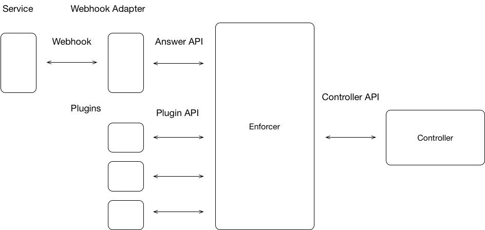

# PADME Enforcer API Draft Spec #

Copyright Kamil Pawlowski 2018

# Introduction #

Application of policies to traffic.

The Enforcer supports several modes of operation.
* Answer mode - In this mode it responds to queries directly.
* Plugin mode - In this mode it configures other components to enforce policies
on its behalf.

An Enforcer may operate in both modes simultaneously depending on upon the 
policy configuration.

In answer mode the Enforcer is queried as to whether or not some specific piece 
of traffic is acceptable under the policies known by the enforcer. For example 
it may plug into envoy to make decision as to whether or not some specific web
service request is permissible.

In Plugin mode the Enforcer uses plugins to configure external components that
enforce policies.  For example an enforcer may delegate packet level enforcement
to IP Chains, or Authorization of Kubernetes requests to OPA. In Plugin mode
policies must still have fields that they apply to filled in so that 
testing of policies off line can occur, and so that policies remain 
intelligible.

# APIS #

The Enforcer supports the following APIS: 
* Packet Level Answer API
* Request Level Answer API
* Plugin API
* Controller API

The first two are used to implement Answer Mode. The third is used to implement
Plugin Mode. The last of these is used as the interface between the PADME 
Controller.  All four APIs are described in this document.

It is expected that an Enforcer may be implemented in or out of process. The
APIs defined here are defined in-process using golang syntax. Conversion
to HTTP end points is done by turning the request into a JSON serialized post.
HTTP Callbacks for the Controller API are not yet defined.  The APIs may 
support a request id scheme, where the caller asserts a numerical ID 
for a given request and the response to that request is passed with
the same ID to allow for faster responses.

Finally, and with a touch of irony, authorization of callers to any of the 
Enforcer APIs is still TBD.  For example how Controllers and Enforcers will
authorize each other is still TDB. It should be assumed however that these 
kinds of operations will go over SSL. 

## Packet Level Answer API ##
The Packet Level Answer API supports infrequent low level look ups such as
those that might be found in software defined networking. 

    //
    // Answer inspects a packet, extracts any protocol information that it can
    // from the packet, and matches it against policies known by the enforcer.
    // 
    // true is returned if policies allow this traffic.
    // false is returned if policies do not allow this traffic, or if
    // the packet was not understood.
    //
    func Answer(packet byte[]) (bool)

## Request Level Answer API ##
The Request Level Answer API supports most normal services requests. For 
example a web services request for a specific target URL uses this call.

    //
    // Answer matches a request described by properties and credential
    // against the rules known by this enforcer.
    // 
    // properties are the intrinsic properties of a given request. For
    // example the source tcp port or the destination ip address, or the
    // target URI. These are composed (along with the credential)
    // into a resource object. Composition of the properties is done
    // using an AND operation.
    //
    // Care must be taken in this API to ensure that standard
    // values for Layer and LType are readily available.
    //
    // No wild carding is permitted in a request.
    //
    // true is returned if policies allow this request.
    // false is returned if policies do not allow this request. 
    //
    func Answer(properties []*policy.Rule, credential *policy.Credential) (bool)

## Plugin API ##
The Plugin API is used to configure sub-components that enforce policies on
behalf of the Enforcer.

    // The Plugin interface is implemented by or on behalf of an external 
    // Policy enforcement component. There can only be one
    // plugin with a given id on any given enforcer, and this id must
    // be consistent throughout the zone.
    //
    // Policies that have a non-empty CContents apply use this interface
    // to configure the specified plugin.
    //
    // As there is no guarantee that the sub-component understands time.
    // A policy is not applied to the plugin until the start time in 
    // its Duration field. It is unapplied at the end time.  This 
    // must be taken into account when testing policies.
    // 
    // Registered, Unregistered, Enabled, Disabled.
    //
    // Plugins register themselves with the enforcer when they
    // are ready to operate and unregister themselves when
    // they are no longer able or willing to operate. Additionally
    // controllers can instruct enforcers to ignore certain
    // plugins by disabling them.
    //
    // By default specific plugins are disabled.
    //
    type Plugin interface {
        // unique id of this plugin in the zone
        PluginID string

        // apply the policy information provided by a policy 
        //
        // Parameters:
        // id - an identified asserted by the enforcer through which
        // subsequent operations regarding this policy.
        // data - the Blob specified in the Contents part of the Policy
        //
        // return (bool, error)
        //   true - the policy was applied
        //   false - the policy was not applied
        //   string - a human readable error returned by the plugin. valid 
        //     if false is returned.
        Apply(id int, data []byte) (bool, string)

        // remove a policy that was previously applied
        //
        // Parameters:
        // id - the id asserted when the policy was applied
        //
        // return (bool, error)
        //   true - the policy was removed, or did not exist
        //   false - the policy was not removed
        //   string - a human readable error returned by the plugin. valid
        //     if false is returned.
        Remove(id int) (bool, string)
    }

    // register the specified plugin with the enforcer.  Only one 
    // plugin with a specified id may be registered with an enforcer
    // at a time. If a plugin could not be registered it should
    // not attempt enforcement actions.
    //
    // Upon registration of a new plugin, assuming the plugin
    // is enabled, all policies are evaluated and any that control 
    // this plugin apply themselves to this plugin.
    // 
    // Parameters:
    // plugin - the plugin object used to control this plugin
    //
    // return:
    //    true - the plugin was successfully registered
    //    false - the plugin could not be registered
    //
    func Register(plugin *Plugin) (bool)

    // remove a plugin from the enforcer. When this occurs
    // all applied policies are removed. 
    //
    // Parameters:
    // plugin - the plugin object used to control this plugin
    // 
    // return:
    //   true - the plugin was successfully unregistered
    //   false - the plugin was not successfully unregistered.
    //
    func Unregister(plugin *Plugin) (bool)

## Controller API ##
The Controller API defines interactions between an Enforcer and a Controller.
Controller/Enforcer discovery is presently not covered here.  Mutual knowledge
is assumed.  This API is also agnostic as to whether or not push or pull is
used between the Enforcer and Controller.

    type PolicyEvent int

    // This defines events that a controller can be notified about occurring
    // on a given enforcer
    const (
        // a policy was applied, for example if a plugin was added/enabled,
        // or if its start time passed.
        PLUGIN_APPLY PolicyEvent = 0
        // an attempt to apply a policy failed
        PLUGIN_APPLY_ERROR PolicyEvent = 1
        // a policy was removed, for example if a plugin was removed or 
        // the end time of a policy passed.
        PLUGIN_REMOVE PolicyEvent = 2
        // an attempt was made to remove a policy, however
        // this attempt  failed
        PLUGIN_REMOVE_ERROR PolicyEvent = 3
    )

    //
    // Controllers are expected to implement this interface to be notified
    // of events occurring on policies.
    //
    type PolicyEventHandler interface {
        //
        // This is called when an event occurs on a policy
        // the version and description of the policy are passed to
        // the controller.  An optional notes field 
        // is used to carry the error string in the event of 
        // a PLUGIN_APPLY_ERROR or PLUGIN_REMOVE_ERROR
        //
        // Parameters:
        //   event - the event
        //   policyVersion - the version of the policy that was effected
        //   policyDescription - the description of the policy that was effected
        //   notes - an error description or empty
        Handle(event PolicyEvent, policyVersion uint64, policyDescription string, notes string) 
    }

    //
    // register a controller with this enforcer for notifications of events
    // 
    // The controller must specify an id by which it will be known to this enforcer.
    // this id must be unique among controllers.
    //
    // Parameters:
    //  id - the controller id
    //  handler - the handler which is to be called when an event occurs.
    //
    // Return 
    //   true - registration succeeded
    //   false - registration failed
    //
    Register(id int, handler *PolicyEventHandler) (bool)
    
    //
    // remove the registration of a controller with this enforcer.
    // unlike plugins the unregistration of a control does not 
    // effect the state of policies installed on this enforcer.
    // Simply, events that might have been reported to unregistered
    // controller are simply lost.
    //
    // Parameters:
    //   id - the id of a previously registered controller
    //
    Unregister(id int)

    //
    // Apply a policy bundle to the enforcer.
    //
    // Policies are specifically ordered.  Thus the addition, removal, or 
    // modification of one or more policy requires a new policy bundle to 
    // be applied to the enforcer. The enforcer is responsible for 
    // determining which policies have been added or removed and 
    // modifying its state or the state of its plugins as necessary.
    // If no PolicyVersions change, and no policies are added 
    // or removed, then nothing is done.
    //
    // A return code is provided, however failures for individual policies
    // are returned via the PolicyEventHandler.
    //
    // Rollback is achieved by shipping an old policy bundle with higher
    // version numbers.
    // 
    // Parameters:
    //  bundle - the policy bundle to apply
    //
    // Return:
    //   true - all policies were applied
    //   false - some polices were not applied, see PolicyEventHandler
    //     for specific issues
    //
    func Apply(bundle *PolicyBundle) (bool)

    //
    // return the current policy bundle from this enforcer
    //
    func Fetch() (*PolicyBundle)

    //
    // return a list of all the plugins supported by this enforcer.
    //
    func Plugins() ([]string)

    // Explicitly enable a particular plugin.  
    //
    // If the plugin is already registered then this causes
    // it to become enabled and causes all policies that
    // use this plugin to be applied. If the plugin is
    // not registered then when it registers it automatically
    // becomes enabled.
    //
    // Specific errors encountered during the application of 
    // policies are returned via the PolicyEventHandler
    //
    // Parameters:
    //  pluginID - the id of the specific plugin
    //
    // Returns:
    //   true - the plugin was enabled
    //   false - the plugin could not be enabled
    func Enable(pluginID string) (bool)

    // Explicitly disable a particular plugin.
    //
    // If the plugin is already registered, then all policies
    // operating through it are removed from the plugin.
    // If the plugin is not registered then the decision
    // is remembered and it must be explicitly enabled
    // before operating again.
    //
    // Specific errors encountered during the removal of 
    // policies are returned via the PolicyEventHandler
    //
    // Specific errors encountered during the application of 
    // policies are returned via the PolicyEventHandler
    // Parameters:
    //  pluginID - the id of the specific plugin
    //
    // Returns:
    //   true - the plugin was disabled 
    //   false - the plugin could not be disabled
    //
    func Disable(pluginID string) (bool)

# Examples, API Implementations, and Mappings #
In this section a number of possible integrations are postulated and
described. First an idealized web hooks is presented, then integrations
for [kubernetes](https://kubernetes.io/) and [SPIFFE](https://spiffe.io/) 
are proposed.

## Generic Webhook API ##
The intent of PADME is to provide a generalized authorization mechanism. As such
PADME exposes it policy decision engine in terms of the Answer and Plugin APIs. 
However this interface is not implemented by most systems. The general industry
direction is to provide a Webhook for external authentication.  In the case 
of Kubernetes, the SubjectAccessReview Webhook can be adapted to PADME's needs
as described elsewhere in this document.  However PADME has an opinion about
the kind of data that it would prefer to receive from such a callback.

### Request ###
The following is a proposed general JSON data object that can be passed to
PADME for conversion to the Answer API.  This is presently tailored towards
web service requests.

    {
        "version": "padme.webhook/v1"
        "ip": {
            "src": "10.0.0.1",
            "dst": "10.0.0.2"
        },
        "tcp": {
            "src": "33333",
            "dst": "443"
        },
        "ns": {
            "src": "a.host.net"
        },
        "http": {
            "verb": "get",
            "urn": "some/service/path"
            "authorization": {
                "type": "basic",
                "credentials: "YMMV"
            }
            "headers": [
                "header name": "header value"
            ]
        }
    }

This scheme gives PADME the ability to make decisions about a wide range of 
factors related to this request.  The ns field and the http.headers fields are 
optional.  Providing the Answer API the remaining http headers allows
the transparent construction of more sophisticated behaviors without
expanding the Webhook interface. (A change that would likely have to 
occur in many places). 

A future extension might be to add a field for the certificate used to secure 
the connection. 

Support for QUIC over UDP replaces the tcp section with an equivalent "udp" 
section.

Translation of these fields into PADME rule patterns generates a name=value
element. In PADME rule terms, the Layer for ip, tcp, udp and ns is network.
The Layer for http is Transport. (The precise names of layers may change as
the proposal is considered further, and yes Transport has a known existing 
meaning in the networking space).  

Version does not presently have
an administrative space assigned for it in the Enforcement Surface Onion 
(ESO).

The LType is the respective, ip, tcp, udp, ns or http. Headers are named:
'headers.header name'.

Thus an example rule resulting from this might be:

    { Layer: "network", LType: "tcp", Pattern: "src=33333" }

### Response ###
The response to a call of this nature might look like this:

    {
        "version": "padme.webhook/v1",
        "allowed" : "true"
    }
or

    {
        "version": "padme.webhook/v1",
        "allowed" : "false"
    }

## kubernetes ##
PADME is able to interact with both Kubernetes authorizers and admission 
controllers. 

### Authorizers ###
Kubernetes supports four different authorization modes:
Node, ABAC, RBAC and Webhook. For new installations PADME recommends
using Webhook authorization. For existing installs, where a large
amount of effort has been invested into authorizers the following
approaches are suggested.

#### Node ####
[Node](https://kubernetes.io/docs/admin/authorization/node/) is used
only for kubelets. Its configuration can change if RBAC is also 
configured.  Otherwise a kubelet must have a credential that specifies 
the system:nodes group and a username of system:node:<nodeName>.  As 
such it is omitted further in this discussion, and should be only configured 
if RBAC is used.

#### ABAC ####
[ABAC](https://kubernetes.io/docs/admin/authorization/abac/) is configured 
via a configuration file.  To reload this file the API server must be 
restarted.  As such this mode fits into PADME's plugin mode of control.
Any policy to configure this infrastructure requires a translation
into PADME Rules/RuleSets so that the policy can be reasoned about
effectively. (This translation is done using the Webhook 
structures described below). However, the specific policy contents to be written
to the ABAC file are carried in the policy contents.  One PADME policy 
per ABAC policy line is recommended.  

#### RBAC ####
[RBAC](https://kubernetes.io/docs/admin/authorization/rbac/) is configured
using kubctl or API calls.  While it is possible to convert users and 
roles/ClusterRoles to PADME policies, user groups are created and managed
as part of the kubernetes [authentication](https://kubernetes.io/docs/admin/authentication/)
process. Thus they are not visible to PADME. As such PADME can act 
as distribution system and should use plugin mode.  To reason about policies
a request can be thought of a combination of:
    user verb resource
Policies can then be created the flatten user/group role bindings into 
matching policies. These can the be used to try new policies for testing.

#### Webhook ####
The kubernetes [Subject Access Review API Web Hook](https://kubernetes.io/docs/admin/authorization/webhook/) 
creates requests that look like this:

    {
        "apiVersion": "authorization.k8s.io/v1beta1",
        "kind": "SubjectAccessReview",
        "spec": {
            "resourceAttributes": {
            "namespace": "kittensandponies",
            "verb": "get",
            "group": "unicorn.example.org",
            "resource": "pods"
        },
        "user": "jane",
            "group": [
            "group1",
            "group2"
            ]
        }
    }

This can be translated into an answer query that (in JSON) might look like the 
following. Note that the Pattern field contents are different for each 
Rule Layer/LType combination. Further the Credential field also continues to 
need further elaboration, as we have not yet solidified our RBAC to policy 
mapping. A possible example of the use of that fields is provided here:

    {
        "properties": [
            { "Layer": "application", "LType": "k8s", "Pattern": "kind=subjectAccessReview" },
            { "Layer": "application", "LType": "k8s", "Pattern": "namespace=kittensandponies" },
            { "Layer": "application", "LType": "k8s", "Pattern": "verb=get" },
            { "Layer": "application", "LType": "k8s", "Pattern": "apiGroup=unicorn.example.org" },
            { "Layer": "application", "LType": "k8s", "Pattern": "resource=pods" },
            { "Layer": "application", "LType": "k8s", "Pattern": "group=group1" }
            { "Layer": "application", "LType": "k8s", "Pattern": "group=group2" }
        ],
        "credential" { "name": "user", "value": "jane" }
    }

Note that the naming in the Webhook of apiGroup is slightly different from that
in [K8s ABAC](https://kubernetes.io/docs/admin/authorization/).

The omission from the Webhook API is any mechanism by which a user is
authenticated. In an ideal world some user credential would be provided.
(even thought authentication has already been done by kubernetes when 
authorization is invoked).

### Admission Controllers ###
PADME can also interact with
[admission controller webhooks](https://kubernetes.io/docs/admin/admission-controllers/). 
Specially, validating admission controllers. At time of writing the 
[image policy webhook](https://kubernetes.io/docs/admin/admission-controllers/#imagepolicywebhook)
can be supported.  An adapter must be used to convert the Webhook into an 
answer API query and back.  

The image policy Webhook creates a request that looks like this:

    {
        "apiVersion":"imagepolicy.k8s.io/v1alpha1",
        "kind":"ImageReview",
        "spec":{
            "containers":[
            {
                "image":"myrepo/myimage:v1"
            },
            {
                "image":"myrepo/myimage@sha256:beb6bd6a68f114c1dc2ea4b28db81bdf91de202a9014972bec5e4d9171d90ed"
            }
            ],
        "annotations":[
            "mycluster.image-policy.k8s.io/ticket-1234": "break-glass"
        ],
        "namespace":"mynamespace"
        }
    }

This can generate a possible mapping as follows:

    {
        "properties": [
            { "Layer": "application", "LType": "k8s", "Pattern": "kind=ImageReview" },
            { "Layer": "application", "LType": "k8s", "Pattern": "image=myrepo/myimage:v1" },
            { "Layer": "application", "LType": "k8s", "Pattern": "image=myrepo/myimage@sha256:beb6bd6a68f114c1dc2ea4b28db81bdf91de202a9014972bec5e4d9171d90ed" },
            { "Layer": "application", "LType": "k8s", "Pattern": "mycluster.image-policy.k8s.io/ticket-1234=break-glass" },
            { "Layer": "application", "LType": "k8s", "Pattern": "namespace=mynamespace"},
        },
        "credential" { "name": "", "value": "" }
    }

## SPIFFE ##
SPIFFE defines a format for resource identification called the 
[SVID](https://github.com/spiffe/spiffe/blob/master/standards/SPIFFE-ID.md).
SVIDs can be represented by a 
[x509 certrificate](https://github.com/spiffe/spiffe/blob/master/standards/X509-SVID.md).
To use SVID with PADME the credential field is expanded as follows:

    type Credential struct {
        Name string
        Value string
    }

becomes

    type CredentialType int
    const (
        USERNAME_PASSWORD CredentialType = 0
        SPIFFE = 1
    )

    type Credential interface {
        // return the type of the credential
        getType() CredentialType
        // compare credentials
        // return true if this credential accepts c1 as valid, 
        // false otherwise
        Accept(c1 *Credential) bool
    }

In this circumstance, application calling Answer must provide as SPIFFE leaf 
cert for its credential.  The policy is distributed with the SPIFFE Signing
cert in its credential field. (Future implementations can optimize the 
obvious duplication issues away).  Verification the proceeds as per 
the SPIFFE documentation, by verifying the signature on the provided leaf 
certificate.  

SPIFFE is agnostic to the meaning of the path (SPIFFE name) contained in an 
SVID. At this juncture it is not clear what that meaning should be in a 
PADME context. As such PADME is agnostic on this subject.

## TBDs ##
* Does it make sense to add a forward mode where requests are forward to a specific plugin.
* Check the docs to see if a unique ID for a policy is also required.
